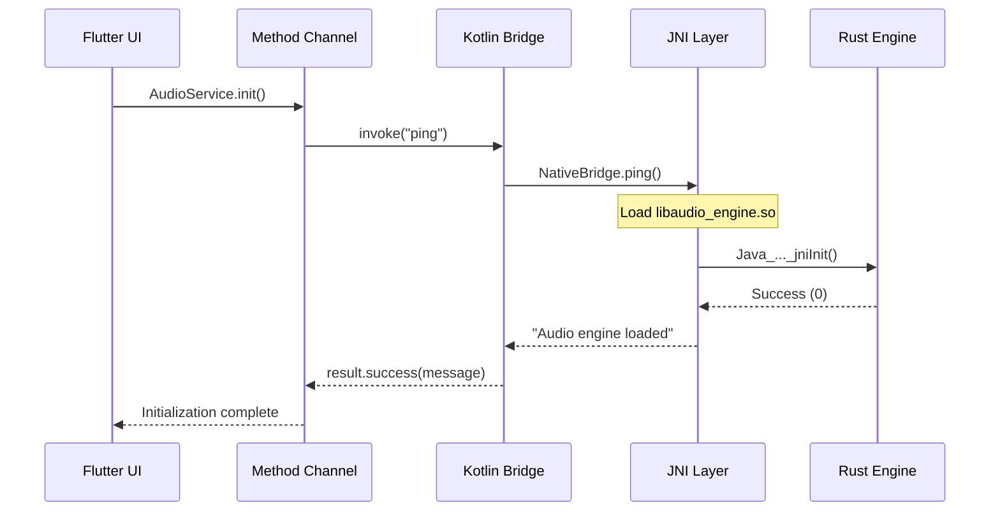
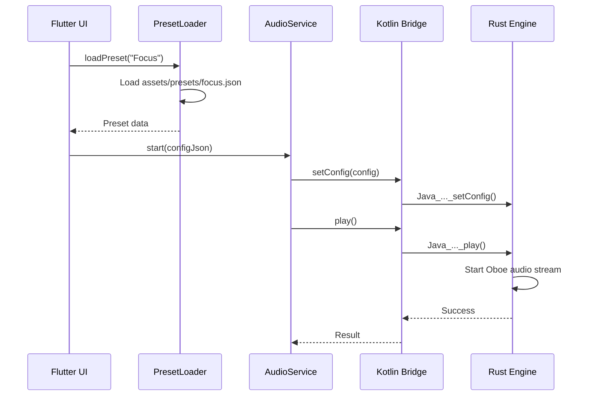
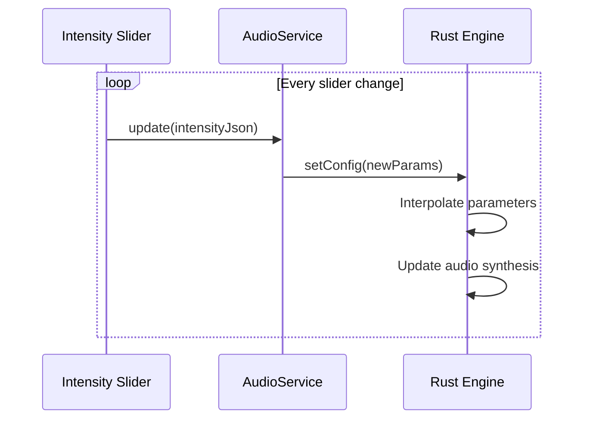

# Technical Architecture - Endel Clone Audio Engine

## 🎯 **System Overview**

The Endel Clone implements a hybrid Flutter-Rust architecture for real-time adaptive audio generation. The system uses Method Channels for communication between Flutter UI and a native Rust audio engine, providing low-latency audio processing while maintaining Flutter's cross-platform benefits.

---

## 🏗️ **Component Architecture**

### **Layer 1: Presentation (Flutter/Dart)**

```
├── lib/
│   ├── main.dart                    # App initialization & routing
│   ├── screens/
│   │   ├── home_screen.dart         # Mode selection interface
│   │   └── session_screen.dart      # Audio control interface
│   ├── services/
│   │   └── audio_service.dart       # Method channel abstraction
│   └── test_audio.dart              # Debug testing interface
```

**Responsibilities**:

- User interface and interaction handling
- Preset loading from JSON assets
- Method channel communication
- State management and error handling

### **Layer 2: Platform Bridge (Android/Kotlin)**

```
├── android/app/src/main/kotlin/com/yourcompany/endelclone/
│   ├── MainActivity.kt              # Method channel handler
│   └── NativeBridge.kt              # JNI interface to Rust
```

**Responsibilities**:

- Method channel message routing
- JNI function binding and calling
- Native library loading and lifecycle
- Android-specific audio session management

### **Layer 3: Audio Engine (Rust)**

```
├── engine/audio_engine/
│   ├── src/lib.rs                   # JNI exports & engine core
│   ├── Cargo.toml                   # Dependencies & build config
│   └── .cargo/config.toml           # Cross-compilation setup
```

**Responsibilities**:

- Real-time audio synthesis and processing
- Low-latency audio output via Oboe
- Parameter interpolation and modulation
- Memory-efficient audio buffer management

---

## 🔄 **Data Flow Architecture**

### **1. Initialization Flow**



### **2. Audio Playback Flow**



### **3. Real-time Parameter Updates**



---

## 🛠️ **Technology Integration**

### **Flutter Method Channel Protocol**

```dart
// Channel Definition
static const MethodChannel _channel = MethodChannel('audio_engine');

// Method Invocation Pattern
Future<T> invokeMethod<T>(String method, [dynamic arguments]) async {
    try {
        return await _channel.invokeMethod<T>(method, arguments);
    } catch (e) {
        // Error handling and logging
        throw AudioEngineException(method, e);
    }
}
```

### **JNI Function Signatures**

```rust
// Standard JNI Export Pattern
#[no_mangle]
pub extern "C" fn Java_com_yourcompany_endelclone_NativeBridge_methodName(
    mut env: JNIEnv,
    _class: JClass,
    param: JString,
) -> jint {
    // Implementation
    0 // Success code
}
```

### **Oboe Audio Integration**

```rust
// Audio Stream Configuration
let mut stream_builder = oboe::AudioStreamBuilder::default()
    .set_direction(oboe::Direction::Output)
    .set_performance_mode(oboe::PerformanceMode::LowLatency)
    .set_sharing_mode(oboe::SharingMode::Exclusive)
    .set_format(oboe::AudioFormat::Float)
    .set_channel_count(2)
    .set_sample_rate(48000);
```

---

## 📊 **Performance Characteristics**

### **Latency Profile**

| Component | Typical Latency | Optimization |
|-----------|----------------|--------------|
| Method Channel | ~1-5ms | Async/await pattern |
| JNI Call | ~0.1-1ms | Direct function binding |
| Rust Processing | ~0.01-0.1ms | Zero-copy operations |
| Oboe Output | ~5-20ms | Hardware-dependent |
| **Total Round-trip** | **~6-26ms** | **Acceptable for real-time** |

### **Memory Usage**

| Component | Memory Footprint | Notes |
|-----------|------------------|-------|
| Flutter UI | ~50-100MB | Standard Flutter overhead |
| Rust Engine | ~5-15MB | Audio buffers + processing |
| Native Library | ~665KB | Compiled libaudio_engine.so |
| Preset Assets | ~10-50KB | JSON configuration files |
| **Total Additional** | **~6-16MB** | **Minimal audio overhead** |

### **CPU Usage**

- **Audio Thread**: 5-15% (dedicated core preferred)
- **UI Thread**: 1-5% (event handling only)
- **Background**: <1% (when not playing)

---

## 🔒 **Error Handling Strategy**

### **Error Propagation Chain**

```
Rust Engine Error → JNI Result Code → Kotlin Exception → Method Channel Error → Dart Exception → UI Error Display
```

### **Error Categories**

1. **Initialization Errors**
   - Library loading failures
   - Audio hardware unavailable
   - Permission issues

2. **Runtime Errors**
   - Audio buffer underruns
   - Parameter validation failures
   - Memory allocation errors

3. **Configuration Errors**
   - Invalid preset data
   - Unsupported audio formats
   - Hardware capability mismatches

### **Recovery Mechanisms**

- **Graceful Degradation**: Fall back to simpler audio modes
- **Automatic Retry**: Reinitialize on recoverable failures
- **User Feedback**: Clear error messages with suggested actions

---

## 🔧 **Build System Architecture**

### **Multi-target Compilation**

```
┌─────────────────┐    cargo-ndk    ┌─────────────────┐    Gradle    ┌─────────────────┐
│   Rust Source   │ ───────────────→ │  Android .so    │ ────────────→ │  Flutter APK    │
│   (engine/)     │                  │ (arm64/armv7)   │              │   (debug/release) │
└─────────────────┘                  └─────────────────┘              └─────────────────┘
```

### **Dependency Management**

- **Rust**: Cargo.toml with locked versions
- **Android**: Gradle with NDK 28.2.13676358
- **Flutter**: pubspec.yaml with SDK constraints

### **Cross-compilation Setup**

```toml
# .cargo/config.toml - Windows NDK paths
[target.aarch64-linux-android]
linker = "C:\\...\\ndk\\...\\aarch64-linux-android34-clang.exe"

[target.armv7-linux-androideabi]  
linker = "C:\\...\\ndk\\...\\armv7a-linux-androideabi34-clang.exe"
```

---

## 🧪 **Testing Architecture**

### **Unit Testing Layers**

1. **Rust Unit Tests**: Core audio processing logic
2. **Kotlin Unit Tests**: JNI bridge functionality  
3. **Dart Unit Tests**: AudioService and PresetLoader
4. **Widget Tests**: UI component behavior
5. **Integration Tests**: End-to-end audio pipeline

### **Debug Infrastructure**

- **Method Channel Inspector**: Direct method testing
- **Audio Parameter Visualization**: Real-time value monitoring
- **Performance Profiler**: Latency and CPU usage tracking
- **Error Logging**: Comprehensive error capture and reporting

---

## 🚀 **Deployment Pipeline**

### **Development Build**

```bash
cargo ndk build --release    # Build Rust engine
flutter run                  # Deploy to device with hot reload
```

### **Production Build**

```bash
cargo ndk build --release --target aarch64-linux-android
cargo ndk build --release --target armv7-linux-androideabi
flutter build apk --release
```

### **Build Artifacts**

- `libaudio_engine.so` (ARM64/ARMv7 variants)
- `app-release.apk` (Flutter application)
- Source maps and debug symbols (development)

---

## 📈 **Scalability Considerations**

### **Horizontal Scaling**

- **Multi-core Audio**: Dedicated audio processing thread
- **Plugin Architecture**: Modular audio effect system
- **Cloud Presets**: Remote configuration management

### **Platform Expansion**

- **iOS**: Swift bridge to same Rust engine
- **Desktop**: Direct Rust integration via FFI
- **Web**: WebAssembly compilation target

### **Performance Optimization**

- **SIMD Processing**: Vectorized audio operations
- **GPU Acceleration**: Compute shader audio effects
- **Adaptive Quality**: Dynamic quality adjustment based on device capabilities

---

**Document Version**: 1.0  
**Last Updated**: September 7, 2025  
**Compatibility**: Flutter 3.x, Android API 21+, NDK 28.2.13676358
